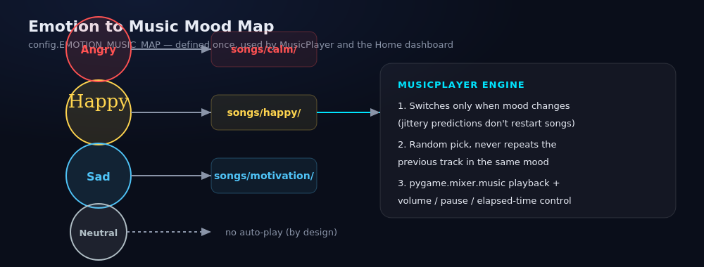

# 🎧 Emotica AI

**Real-Time Emotion Detection & Smart Music Recommendation**

Emotica AI watches your webcam, detects your facial emotion in real time with a CNN, and automatically plays mood-matched music — all inside a dark, glassmorphism-themed Streamlit dashboard. Every detection is logged to SQLite and visualized on a live Plotly analytics page.


---

## Table of Contents

- [Overview](#overview)
- [Features](#features)
- [Emotion → Music Mapping](#emotion--music-mapping)
- [Project Structure](#project-structure)
- [Installation](#installation)
- [Getting a Model — 3 Ways to Train](#getting-a-model--3-ways-to-train)
- [Adding Music](#adding-music)
- [Running the App](#running-the-app)
- [Data & Analytics](#data--analytics)
- [Configuration Reference](#configuration-reference)
- [Performance Notes](#performance-notes)
- [Troubleshooting](#troubleshooting)
- [Technology Stack](#technology-stack)
- [Roadmap Ideas](#roadmap-ideas)
- [License](#license)

---

## Overview

Emotica AI is a Streamlit application built around a simple loop:

> **Webcam → Face Detection (MediaPipe) → Emotion Classification (CNN) → Mood-Matched Music (pygame) → Logged Detection (SQLite) → Live Analytics (Plotly)**

The current model classifies **4 emotions** — `Angry`, `Happy`, `Neutral`, `Sad` — and the project ships with **three different, swappable ways to produce the model file** (`models/emotion_model.h5`), so you can choose the training path that fits your data:

| Script | Approach | Best for |
|---|---|---|
| `train_model.py` | CNN from scratch on the public **FER2013** dataset | Large, generic labeled data (~36k images), no custom data collection needed |
| `train_custom_model.py` | A smaller, heavily-regularized CNN trained on **your own webcam photos** | Small self-collected datasets (hundreds of images), better real-world accuracy for *your* face |
| `train_transfer_model.py` | **MobileNetV2 transfer learning** fine-tuned on your own webcam photos | Best generalization from a small custom dataset — recommended default |

`emotion_model.py` auto-detects which kind of model is loaded (grayscale 48×48 vs. color 96×96) purely from the saved file's input shape, so the rest of the app (camera preprocessing, live inference) adapts automatically — no manual switching required.

---

## Features

- 🎥 **Smooth live webcam feed** — capture runs on its own background thread (`camera.py`) so the UI never blocks on `cv2.VideoCapture.read()`
- 🙂 **MediaPipe face detection** every frame, with a live bounding box overlay
- 🧠 **CNN emotion classification**, throttled to every *N* frames (configurable) since it's the heavier step
- 📈 **Per-detection confidence score** (e.g. `Happy (98%)`), with an "Uncertain" fallback below a configurable threshold
- 🎵 **Automatic, no-repeat music playback**, switching only when the *effective* mood changes (so jittery predictions don't restart a song every frame)
- 🗄️ **SQLite-backed detection history** (`emotica.db`) — thread-safe, one connection per thread
- 📊 **Plotly analytics dashboard** — emotion pie chart, bar chart, timeline, live trend line, and a "top emotion" donut
- 🛠️ **Custom dataset collector** (`collect_faces.py`) — a standalone OpenCV tool to capture your own labeled face bursts for the 4 emotions
- 🎚️ **Fully configurable** camera resolution/FPS, playback volume, auto-play toggle, and confidence threshold, all from the Settings page
- 🌓 **Polished dark glassmorphism UI** shared across every page via a single CSS injection (`utils.py`)
- 🩹 **Graceful degradation** — the app never crashes if the model or songs are missing; it shows clear on-screen guidance instead

---

## Emotion → Music Mapping



| Emotion | Mood Folder | Behavior |
|---|---|---|
| Happy | `songs/happy/` | Upbeat / feel-good tracks |
| Sad | `songs/motivation/` | Uplifting tracks to lift the mood |
| Angry | `songs/calm/` | Calm / relaxing tracks |
| Neutral | — | No auto-play, by design |

This mapping lives in a single place, `config.EMOTION_MUSIC_MAP`, so changing it (or adding moods) never requires touching playback logic.

---

## Project Structure

```
emotica-ai/
├── app.py                      # Home dashboard + shared session state (entry point)
├── camera.py                   # Threaded webcam capture + MediaPipe face detection
├── emotion_model.py            # CNN architectures (3 variants) + cached model loader
├── database.py                 # Thread-safe SQLite persistence layer
├── analytics.py                # Plotly chart builders for the Analytics page
├── music_player.py             # pygame-based mood music playback engine
├── utils.py                    # Glassmorphism theming + shared UI helpers
├── config.py                   # All constants, paths, and the emotion→music map
│
├── collect_faces.py            # Standalone webcam tool to build your own dataset
├── train_model.py               # Train from scratch on FER2013
├── train_custom_model.py        # Train a small CNN on your own collected images
├── train_transfer_model.py      # Train via MobileNetV2 transfer learning (recommended)
├── test_camera.py               # Standalone camera/backend diagnostic tool
│
├── requirements.txt
├── README.md
├── emotica.db                   # SQLite database (created automatically)
│
├── assets/                      # Logo & static images
├── models/                      # emotion_model.h5 lives here (you generate it)
├── data/
│   ├── fer2013.csv              # only needed for train_model.py
│   └── custom/
│       ├── Angry/                # PNG bursts from collect_faces.py
│       ├── Happy/
│       ├── Neutral/
│       └── Sad/
├── songs/
│   ├── happy/                   # Happy   → upbeat tracks
│   ├── motivation/               # Sad     → uplifting tracks
│   └── calm/                     # Angry   → relaxing tracks
│                                  # Neutral → no auto-play, by design
└── pages/                        # Streamlit auto-builds sidebar nav from these
    ├── 1_📷_Live_Detection.py
    ├── 2_📊_Analytics.py
    ├── 3_🎵_Song_Manager.py
    ├── 4_⚙️_Settings.py
    └── 5_ℹ️_About.py
```

> Streamlit auto-discovers everything under `pages/` and builds the sidebar navigation from those files — `app.py` only renders the Home dashboard and initializes the session state every page shares.

---

## Installation

**Requirements:** Python 3.10+, a working webcam, and (for audio) a working audio output device.

```bash
# 1. Clone / unzip the project, then move into it
cd emotica-ai

# 2. Create and activate a virtual environment (recommended)
python3 -m venv venv
source venv/bin/activate        # Windows: venv\Scripts\activate

# 3. Install dependencies
pip install -r requirements.txt
```

<details>
<summary>Key dependencies (see <code>requirements.txt</code> for exact pins)</summary>

```
streamlit>=1.35
opencv-contrib-python==4.11.0.86
tensorflow==2.15.1
mediapipe==0.10.21
numpy==1.26.4
protobuf==4.25.3
pandas>=2.2
Pillow>=10.3
pygame>=2.5
plotly>=5.22
streamlit-extras>=0.4
mutagen>=1.47
```
</details>

Until a trained model exists at `models/emotion_model.h5`, the app runs fine — the Home page shows a clear warning banner and the Live Detection page stays disabled rather than crashing.

---

## Getting a Model — 3 Ways to Train

### Option A — Recommended: MobileNetV2 Transfer Learning on Your Own Face

Best real-world accuracy for a small, personal dataset.

```bash
# Step 1 — collect your own labeled dataset via webcam
python collect_faces.py
#   a / h / n / s  → select label (Angry / Happy / Neutral / Sad)
#   SPACE          → capture a 3-second burst (~20 images)
#   q              → quit
# Aim for 150–200+ images per emotion, across multiple sittings
# (different lighting/rooms) so the model learns expressions, not the room.

# Step 2 — train
python train_transfer_model.py
```

Training runs in two phases: the classification head trains first with the MobileNetV2 backbone frozen, then the last few backbone layers are unfrozen for low-learning-rate fine-tuning. `--head-epochs`, `--finetune-epochs`, `--finetune-layers`, `--batch-size`, and `--val-split` are all configurable via CLI flags.

### Option B — Small CNN From Scratch on Your Own Face

Simpler and faster to train than Option A, still tailored to your own data (uses the same `collect_faces.py` dataset).

```bash
python collect_faces.py            # if not already collected
python train_custom_model.py --epochs 60 --batch-size 32
```

### Option C — Classic CNN on the Public FER2013 Dataset

No webcam data collection required, but the original FER2013 label set is 7-class; you'll want to adapt `config.EMOTION_LABELS` accordingly if you go this route.

```bash
# 1. Download fer2013.csv (Kaggle) and place it at data/fer2013.csv
# 2. Train
python train_model.py --epochs 60 --batch-size 64
```

All three scripts save the best checkpoint to `models/emotion_model.h5` — whichever one you run last is the model the Streamlit app will load. Both custom-data scripts split train/validation **by capture burst, not by individual frame**, since frames from the same 3-second burst are near-duplicates; splitting at the frame level would let near-identical images leak across the split and produce misleadingly high validation accuracy that doesn't hold up on live video.

---

## Adding Music

Drop `.mp3`, `.wav`, or `.ogg` files into the mood folders under `songs/` (see the [mapping table](#emotion--music-mapping) above). Nothing needs to be registered — files are auto-discovered on every page load, and playback picks a random track per mood without repeating the immediately-previous one.

---

## Running the App

```bash
streamlit run app.py
```

Open the printed local URL, go to **📷 Live Detection**, and click **Start Camera**.

---

## Data & Analytics

Every detection (timestamp, emotion, confidence, song played) is written to a local SQLite database (`emotica.db`) via `database.py`. The **📊 Analytics** page (`analytics.py`) turns that history into:

- An emotion distribution **pie chart** and **bar chart**
- A **timeline scatter plot** of detections over time, sized by confidence
- A **live trend line** of confidence over the last N seconds
- A compact **"top emotion" donut** for at-a-glance summaries
- Summary stats: total detections, most frequent emotion, average confidence

---

## Configuration Reference

All tunables live in `config.py` — nothing else in the codebase hard-codes these values:

| Setting | Default | Purpose |
|---|---|---|
| `FACE_IMG_SIZE` | `48` | Input size for grayscale (from-scratch) models |
| `TRANSFER_IMG_SIZE` | `96` | Input size for the MobileNetV2 transfer model |
| `EMOTION_LABELS` | `["Angry","Happy","Neutral","Sad"]` | Class order — must match dataset folder names exactly |
| `INFERENCE_EVERY_N_FRAMES` | `3` | How often the (heavier) CNN classification runs; face *detection* still runs every frame |
| `MIN_FACE_DETECTION_CONFIDENCE` | `0.6` | MediaPipe face detector threshold |
| `DEFAULT_CONFIDENCE_THRESHOLD` | `0.55` | Below this, the UI shows "Uncertain" instead of a label |
| `DEFAULT_CAMERA_WIDTH / HEIGHT` | `640 x 480` | Overridable from the Settings page |
| `DEFAULT_TARGET_FPS` | `30` | Camera capture target |
| `EMOTION_MUSIC_MAP` | see table above | Single source of truth for emotion → mood folder |
| `SUPPORTED_AUDIO_EXT` | `.mp3 .wav .ogg` | File types the Song Manager will discover |

---

## Performance Notes

- Camera capture runs on its own background thread (`camera.py`), so the UI never blocks on `cv2.VideoCapture.read()`; only the latest frame is kept, so consumers never fall behind.
- Face **detection** runs every frame (MediaPipe is fast); CNN **classification** runs every `INFERENCE_EVERY_N_FRAMES` frames since it's the heavier step — this keeps the feed smooth without sacrificing responsiveness.
- The Keras model is loaded **once per server process** via `st.cache_resource`, not on every Streamlit rerun.
- Camera resolution/target FPS are adjustable from the Settings page; actual achievable FPS depends on your webcam and CPU/GPU.
- On Windows, the app prefers the `DSHOW` backend (more reliable than `CAP_ANY`) and automatically falls back across a matrix of backends/indices if the preferred one fails — the same logic `test_camera.py` exposes standalone for diagnostics.

---

## Troubleshooting

**Camera won't open / "No working webcam found"**
Run `python test_camera.py` — it scans every backend/index combo the app would try and reports which one works. Common causes: another app (Zoom/Teams/browser tab) has the camera open, or OS-level camera privacy permissions are off.

**"Emotion model not found" warning on Home page**
You haven't trained a model yet — see [Getting a Model](#getting-a-model--3-ways-to-train). The app is fully usable otherwise; only Live Detection stays disabled.

**No sound / music doesn't play**
Check that `songs/<mood>/` actually contains `.mp3`/`.wav`/`.ogg` files, and that `pygame.mixer.init()` succeeded (check the terminal log — it fails quietly if no audio device is available).

**Model trained but accuracy is poor on live video**
Almost always a dataset issue, not a modeling one: collect more images (150–200+ per emotion), across *multiple sittings* with different lighting, and make expressions clearly exaggerated — see the tips in `collect_faces.py`'s docstring, especially the Angry-vs-Sad distinction.

---

## Technology Stack

**Python 3.10+** · **Streamlit** (UI/pages) · **OpenCV** (video I/O) · **MediaPipe** (face detection) · **TensorFlow / Keras** (CNN + MobileNetV2 transfer learning) · **NumPy / Pandas** (data handling) · **Pillow** · **pygame** (audio playback) · **SQLite** (persistence) · **Plotly** (analytics charts) · **mutagen** (audio metadata)

---

## Roadmap Ideas

- Re-add the additional FER2013 emotion classes (Fear, Surprise, Disgust) as optional mood folders
- Export/import detection history as CSV from the Analytics page
- Multi-face support (currently the largest detected face drives playback)
- Dockerfile for one-command setup

---

## License

No license file is currently included with this project. Add one (e.g. MIT, Apache-2.0) before distributing or open-sourcing.

---

*Emotica AI — built with Streamlit, TensorFlow, and a genuine dislike of choosing your own playlist.*
